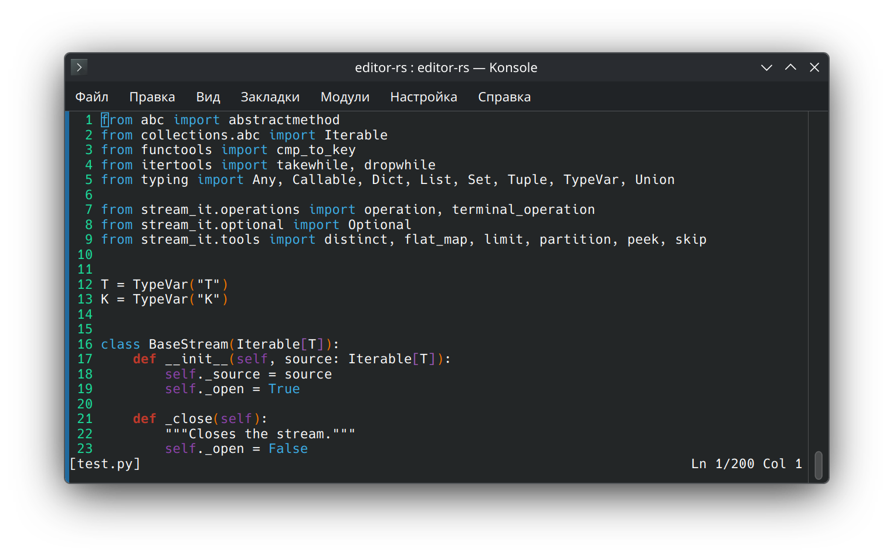
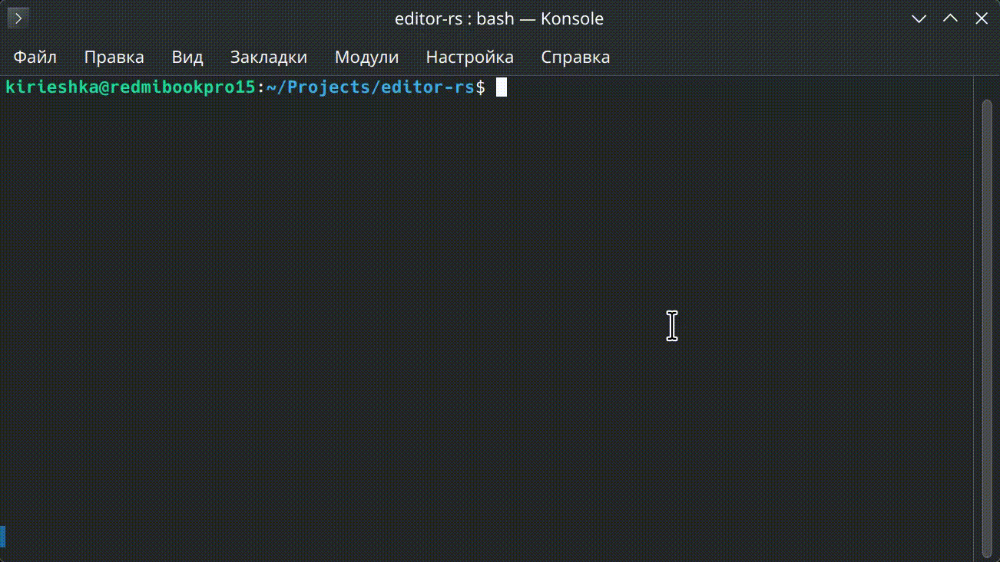

# editor-rs

Минималистичный текстовый редактор в терминале, написанный на Rust.
Поддерживает базовое редактирование текста, навигацию стрелками и сохранение файла.

<p align="center">
    
</p>

<p align="center">
    
</p>

## Возможности

- Открытие файла (или создание нового)
- Нумерация строк в файле
- Вставка и удаление символов
- Перенос строк
- Навигация стрелками
- Сохранение файла
- Поиск по файлу
- Переход к строке файла
- Автоматические отступы (auto-indent)
- Status bar в нижней части редактора
- Работа в raw-режиме терминала через `crossterm`

## Запуск

```bash
# Без аргументов — новый пустой буфер
cargo run

# Открыть существующий файл
cargo run -- path/to/file.txt
```

## Управление

| Клавиша | Действие |
| --- | --- |
| Ctrl + Q | Выход |
| Ctrl + S | Сохранить фaйл |
| Ctrl + F | Поиск по файлу |
| Ctrl + G | Переход к строке |
| ← → ↑ ↓ | Пермещение курсора |
| Enter | Новая строка |
| Backspace | Удалить символ/строку |
| Любой символ | Вставка символа |


## Структура проекта

```
src/
├── main.rs       — точка входа
├── editor.rs     — логика редактора и обработка событий
├── buffer.rs     — хранение текста и операции над ним
├── cursor.rs     — позиция курсора
└── terminal.rs   — обёртка над crossterm
```

## Зависимости
- `crossterm` — работа с терминалом